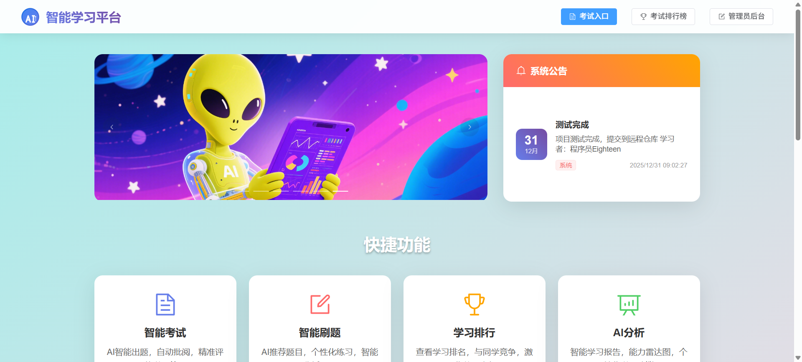
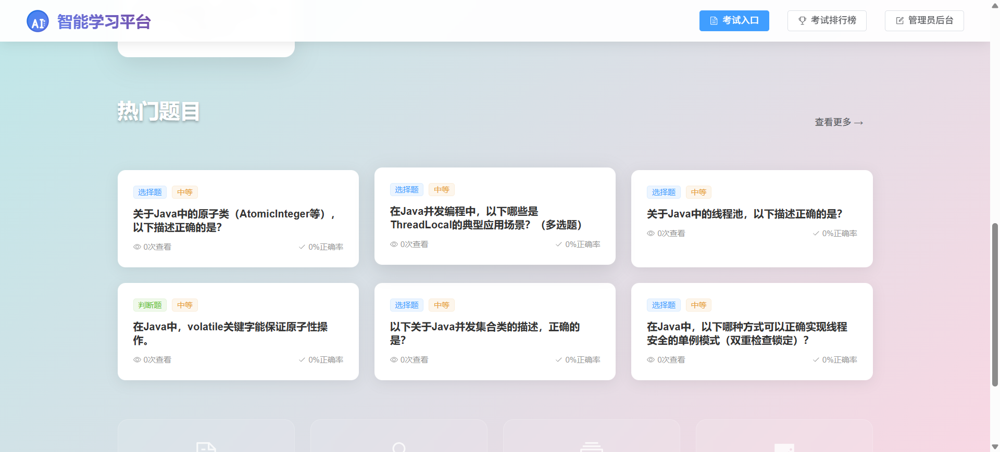
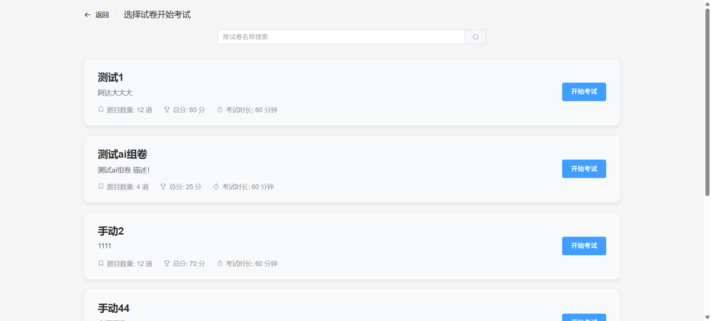
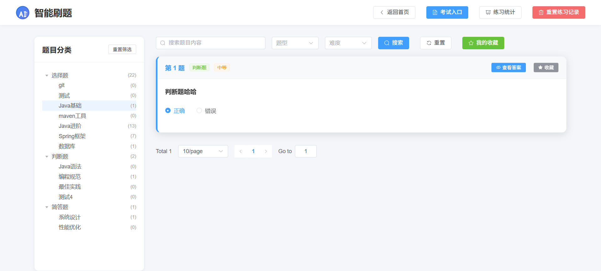
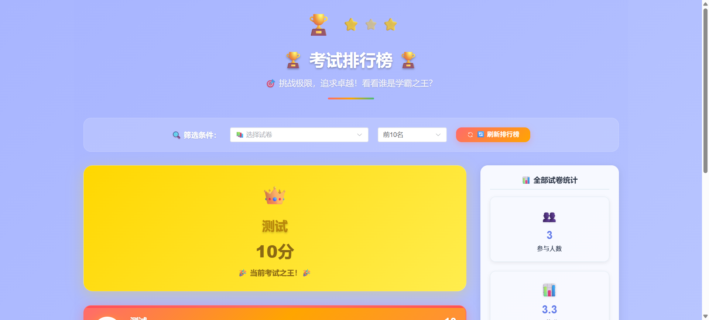
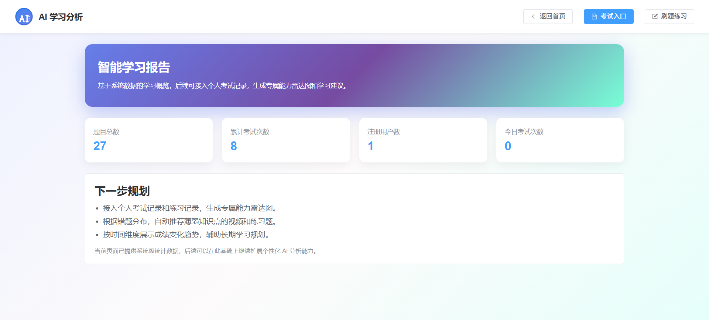
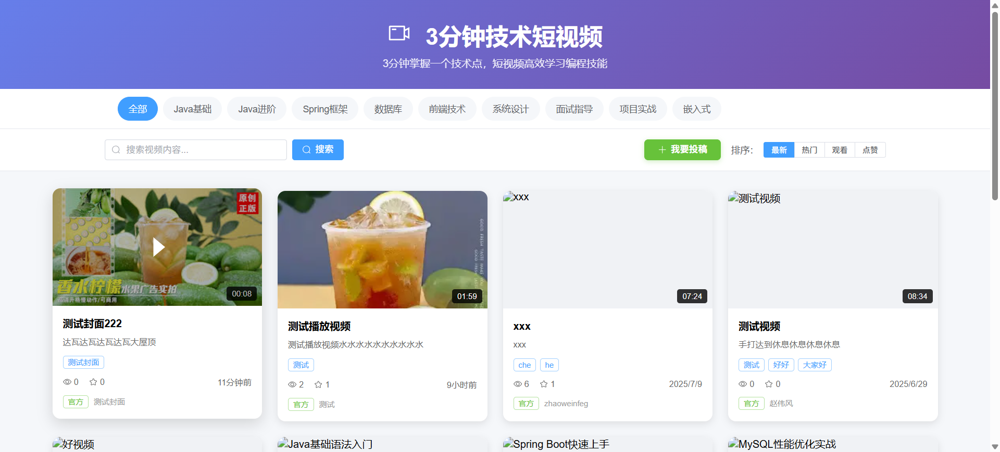
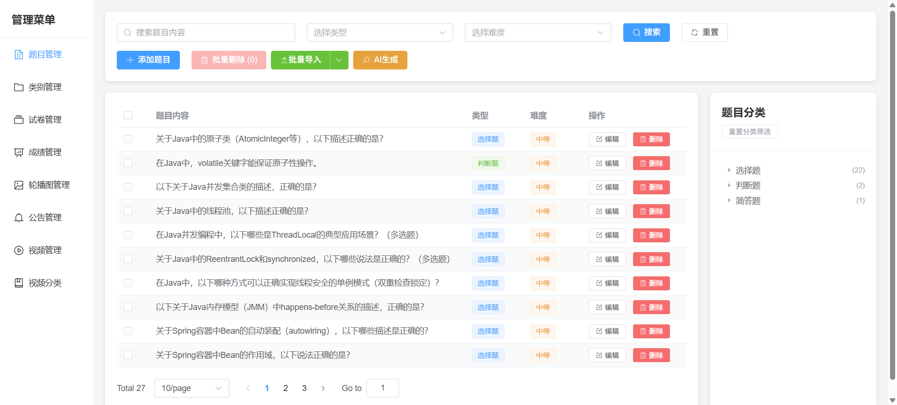

## 项目介绍

Ai Chain Lab（Ai 链习室）是一个面向编程与技术学习者的智能学习平台。  
后端基于 Spring Boot + MyBatis Plus + MySQL + Redis + MinIO，前端基于 Vue3 + Vite + Element Plus + ECharts，支持题库练习、试卷考试、面试真题、视频学习以及 AI 辅助出题与批改等功能。



---

## 功能概览

- 在线刷题：按知识点、公司、难度维度管理题库，支持单题练习与套题刷题
- 试卷与考试：创建试卷、安排考试、自动判分与成绩统计
- 面试模块：模拟面试流程，支持公司真题与系统生成题目
- 视频学习：支持上传、分类、播放、点赞与学习数据统计
- AI 能力：接入 DeepSeek 模型，实现智能出题、智能判卷与学习建议生成
- 统计与分析：提供学习数据统计、考试排行榜、能力雷达图等可视化分析



---

## 技术栈

- 前端
  - Vue 3 + Vite
  - Vue Router
  - Element Plus
  - Pinia
  - Axios
  - ECharts

- 后端
  - Spring Boot 3
  - MyBatis Plus
  - Spring Web / WebFlux
  - Spring Data Redis + Redisson
  - MinIO 对象存储
  - Knife4j / SpringDoc OpenAPI
  - MySQL



---

## 目录结构

项目主要目录结构如下（省略若干次要文件）：

```bash
Ai_Chain_Lab/
├─ Server/          # 后端 Spring Boot 服务
│  ├─ src/main/java/com/gpt/server
│  │  ├─ Controller   # REST API 控制器
│  │  ├─ Service      # 业务接口
│  │  ├─ Service/Impl # 业务实现（含 DeepSeekAI、试卷、视频等）
│  │  ├─ Entity       # 实体类
│  │  ├─ Mapper       # MyBatis Plus Mapper
│  │  ├─ Config       # 配置（MinIO、Redis、Knife4j、WebClient 等）
│  │  └─ Utils / Vo   # 工具类与 VO 对象
│  └─ src/main/resources
│     ├─ application.yml  # 应用与中间件配置
│     └─ Mapper/          # XML 映射文件
│
├─ fronted/         # 前端 Vue3 + Vite 项目
│  ├─ src/api       # 与后端的接口封装
│  ├─ src/views     # 页面视图（练习、考试、视频、分析等）
│  ├─ src/router    # 路由配置
│  └─ src/components# 通用组件
│
├─ Database/
│  └─ ai_chain_lab.sql  # 数据库结构与初始化数据
│
└─ img/             # README 使用的截图资源
   ├─ 1.png
   ├─ 2.png
   ├─ 3.png
   ├─ 4.png
   ├─ 5.png
   ├─ 6.png
   ├─ 7.png
   └─ 8.png
```



---

## 环境准备

- 必备环境
  - JDK 17+
  - Maven 3.8+
  - Node.js 16+
  - MySQL 8+
  - Redis
  - MinIO（或兼容 S3 的对象存储）

- 获取代码

```bash
git clone <your-repo-url> Ai_Chain_Lab
cd Ai_Chain_Lab
```

---

## 数据库初始化

1. 在 MySQL 中创建数据库：

```sql
CREATE DATABASE ai_chain_lab DEFAULT CHARACTER SET utf8mb4 COLLATE utf8mb4_general_ci;
```

2. 导入数据库脚本：

```bash
mysql -u root -p ai_chain_lab < ./Database/ai_chain_lab.sql
```

3. 如有需要，根据实际环境修改 Server 模块中的数据库连接信息（`application.yml` 中的 `spring.datasource.*`）。



---

## 后端服务启动

1. 进入后端目录：

```bash
cd Server
```

2. 修改配置文件：
   - `src/main/resources/application.yml`
     - 数据库地址、账号、密码
     - Redis 地址与端口
     - MinIO 地址、节点、桶名
     - DeepSeek API Key 与模型配置

3. 编译并启动：

```bash
mvn clean package
mvn spring-boot:run
```

4. 启动成功后，可通过以下地址访问：
   - 健康检查接口：`http://localhost:8080/api/test/hello`
   - Knife4j 文档：`http://localhost:8080/doc.html`
   - Swagger UI：`http://localhost:8080/swagger-ui.html`

---

## 前端项目启动

1. 进入前端目录：

```bash
cd fronted
```

2. 安装依赖：

```bash
npm install
```

3. 开发模式启动：

```bash
npm run dev
```

4. 访问地址（默认）：
   - `http://localhost:3001/`（Vite 开发服务器）

构建与预览：

```bash
npm run build
npm run preview
```



---

## 核心模块说明

- 题库与试卷
  - Question / Paper / Exam 等实体及其 Controller、Service、Mapper
  - 支持按分类导入题目、批量管理、随机组卷和固定试卷

- 视频学习
  - Video / VideoCategory / VideoView / VideoLike 等实体
  - 支持视频上传、封面图上传（存储于 MinIO）、分类与推荐

- AI 能力
  - DeepSeek 接入配置（WebClient + DeepSeekProperties）
  - AI 出题、智能批改、学习建议生成等功能

- 统计与分析
  - StatsController 与 StatsServiceImpl 提供学习数据统计接口
  - 前端 Analysis 页面使用 ECharts 绘制能力雷达图与学习数据可视化



---

## 部署与扩展建议

- 前后端可通过 Nginx 进行反向代理与静态资源托管
- MySQL、Redis、MinIO 建议使用 Docker 进行容器化部署
- 可将 DeepSeek API Key 配置到环境变量或独立配置中心，避免明文写入配置文件
- 可在现有基础上继续扩展：
  - 增加更多企业题库与岗位题集
  - 增加学习路径引导与学习计划功能
  - 引入消息队列优化批量任务与统计计算

